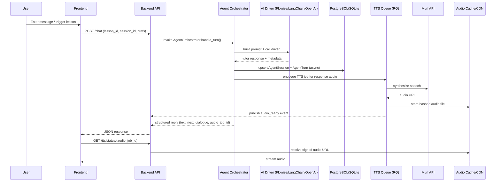

# Hybrid Architecture Overview

This document captures the in-flight redesign of the Patient Polish Tutor into a backend/frontend/agent/TTS hybrid. It highlights the current orchestration flow, clarifies async boundaries, and tracks the major platform improvements under consideration.

## End-to-End Orchestration Flow

**Notes**
- Every I/O hop (DB, AI HTTP calls, queue operations) is async to avoid blocking request threads.
- AgentOrchestrator delegates to pluggable drivers (`ai_agent/drivers/openai.py`, `flowise.py`, etc.) so model providers can change without touching orchestration logic.
- TTS processing occurs out-of-band via RQ workers to keep `/chat` latency low.

## Improvement Tracker

| Area | Issue | Recommendation |
| --- | --- | --- |
| Orchestration flow | No explicit pipeline linking AI → DB → TTS | Document the sequence above and keep it updated in `ARCHITECTURE.md`; use `docs/diagrams/` for exported PNGs if needed. |
| Async consistency | Mixed sync/async code paths | Standardize on async repositories, HTTP clients, and queue producers (e.g., `asyncpg`, `httpx`, `aioredis`). |
| Agent abstraction | Tight coupling to Flowise/OpenAI | Introduce driver pattern in `ai_agent/drivers/` with a shared interface (`AgentDriverProtocol`) and dependency injection. |
| Session scalability | Heavy per-turn DB writes | Add Redis caching for hot session state plus background summarization to compress transcripts. |
| TTS | No queue resilience | Use RQ (or Celery) workers with deduplicated cache hashing and retryable Murf jobs. |
| Auth | JWT story incomplete | Implement full auth flow including refresh tokens, rotation, and `Authorization` middleware. |
| Deployment | Missing automated pipeline | Provide Docker Compose for local stacks and GitHub Actions for CI/CD (lint, tests, build, deploy). |
| Monitoring | No observability | Add Prometheus metrics, Grafana dashboards, and Sentry error tracking. |
| Prompt management | Static, opaque prompts | Store prompts in versioned YAML with schema (id, version, tags); surface commit hash in responses for reproducibility. |

## Next Steps
1. Translate the mermaid diagram into a saved asset (`docs/diagrams/orchestration-seq.mmd`) so it can be rendered automatically in docs tooling.
2. Wire the driver pattern inside `ai_agent/orchestrator.py`, injecting `AgentDriver` via FastAPI dependencies.
3. Prototype RQ workers for Murf synthesis and validate cache hashing strategy.
4. Extend this document with data flow diagrams (DFD) and deployment topology once infrastructure decisions are finalized.
