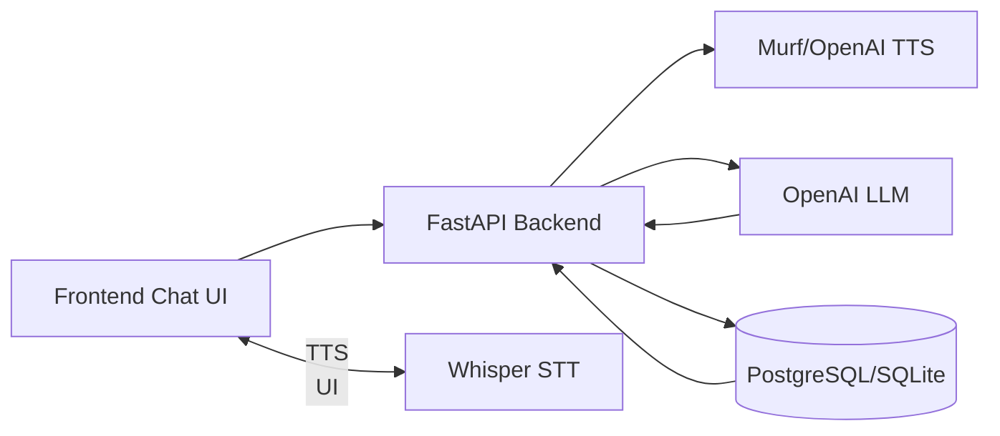

# 📘 **Patient Polish Tutor — Advanced Lesson Interactivity Specification**

## **Status Legend**
- ✅ **Fully Implemented** — Feature is complete and working
- 🟡 **Partially Implemented** — Feature exists but needs completion or enhancement
- ❌ **Not Implemented** — Feature is not yet built

---

# **📑 Table of Contents**

1. [Overview](#overview)
2. [Core Goals](#core-goals)
3. [Chat-Based Lesson Flow](#1-chat-based-lesson-flow) ✅
4. [Micro-Dialog Logic](#2-micro-dialog-logic) ✅
5. [Lesson Modes](#3-speaking--listening-modes) 🟡
6. [Pronunciation Scoring](#4-confidence-meter--scoring) ✅
7. [Adaptive Difficulty Engine](#5-adaptive-lesson-difficulty) 🟡
8. [Context Cards](#6-context-cards) ❌
9. [Translation Toggle](#7-translation-toggle) 🟡
10. [Slow-Mode Pronunciation](#8-slow-mode-pronunciation) ✅
11. [Chat UI Redesign](#9-chat-ui-redesign) ✅
12. [Key Phrase Drill Mode](#10-key-phrases--drill-mode) ✅
13. [Multiple Attempts Logic](#11-multiple-attempts) ✅
14. [End-of-Lesson Summary](#12-end-of-lesson-summary) ✅
15. [Dynamic Expansion With AI](#13-dynamic-ai-expansion) 🟡
16. [Daily Practice Packs](#14-daily-practice-mode) 🟡
17. [Adaptive CEFR Progression](#15-cefr-progression-engine) ✅
18. [System Architecture](#system-architecture) ✅
19. [Database Schema](#database-schema) ✅

---

# 📘 **Overview**

The goal is to evolve the existing lesson interface from a static preview into a **high-engagement, adaptive, conversation-driven tutor**, similar to:

- Duolingo Speaking
- Rosetta Stone
- Pimsleur
- Speechling
- CEFR A0–A2 classroom methods

This design aligns your app with best-in-class language pedagogy.

---

# 🎯 **Core Goals**

- ✅ Increase **speaking practice** — Speech recognition implemented
- ✅ Make learning **conversational** — Chat-based UI implemented
- ✅ Provide **real-time corrective feedback** — Feedback engine working
- 🟡 Auto-adjust lesson difficulty — Scoring exists, but no dynamic lesson adjustment
- ✅ Track long-term progress — Progress tracking implemented
- 🟡 Promote daily practice — Backend exists, UI missing
- ✅ Support A0 → A2 progression — CEFR tracking implemented

---

# 💬 **1. Chat-Based Lesson Flow (One Phrase at a Time)** ✅

### Status: **Fully Implemented**

### Implementation Details:
- **File**: `frontend-react/src/pages/LessonChatPage.tsx`
- **Backend**: `src/api/routers/v2/lessons.py`
- **Service**: `src/services/lesson_flow.py`

### Current Behavior:
- ✅ Tutor shows typing animation
- ✅ Tutor speaks the phrase (audio playback)
- ✅ Tutor asks user to repeat
- ✅ User answers via text/microphone
- ✅ System evaluates response
- ✅ If correct → next phrase
- ✅ If incorrect → retry with guidance

### Flow Diagram

```mermaid
flowchart TD
    A[Start Lesson] --> B[Show Tutor Phrase 1]
    B --> C[Play Audio]
    C --> D[Prompt: Repeat]
    D --> E[User Repeats (mic/text)]
    E --> F{Correct?}
    F -->|Yes| G[Positive Feedback]
    G --> H[Next Phrase]
    F -->|No| I[Help + Retry]
    I --> E
    H --> Z{Last Phrase?}
    Z -->|No| B2[Show Next Tutor Phrase]
    B2 --> C
    Z -->|Yes| J[End-of-Lesson Summary]
```

---

# 🗣️ **2. Micro-Dialog Logic** ✅

### Status: **Fully Implemented**

### Implementation Details:
- **File**: `src/core/tutor.py`
- **Feedback Engine**: `src/services/feedback_engine.py`

### Current Behavior:
- ✅ Tutor asks questions
- ✅ Encourages speaking
- ✅ Waits for user response
- ✅ Evaluates the answer
- ✅ Gives gentle corrections
- ✅ Moves forward only when ready

### Notes:
The tutor uses `FeedbackEngine` to generate empathetic responses based on user performance.

---

# 🎧 **3. Speaking / Listening Modes** 🟡

### Status: **Partially Implemented**

### Implementation Details:
- **Speech Recognition**: `frontend-react/src/hooks/useSpeechRecognition.ts` ✅
- **Text Input**: `frontend-react/src/components/UserInputCard.tsx` ✅
- **Mode Toggle**: ❌ Not implemented

### What's Working:
- ✅ Speech recognition via microphone
- ✅ Text input as alternative
- ✅ Both methods work simultaneously

### What's Missing:
- ❌ Explicit toggle between "Listening Mode" (no repetition) and "Speaking Mode" (must repeat)
- ❌ UI control to switch modes
- ❌ Backend logic to skip evaluation in listening mode

### Recommendation:
Add a toggle button in the lesson UI to switch between modes.

---

# ⭐ **4. Confidence Meter & Scoring** ✅

### Status: **Fully Implemented**

### Implementation Details:
- **Components**: 
  - `frontend-react/src/components/StarRating.tsx` ✅
  - `frontend-react/src/components/ScoreBar.tsx` ✅
  - `frontend-react/src/components/messages/FeedbackMessage.tsx` ✅
- **Backend**: `src/services/evaluator.py` ✅

### Current Behavior:
- ✅ Each phrase receives a score (0.0 - 1.0)
- ✅ Visual star rating display (⭐⭐⭐ Perfect, ⭐⭐ Good, ⭐ Needs practice)
- ✅ Scores stored in database (`phrase_attempts` table)
- ✅ Used for progress tracking

### Scoring System:
- **High (≥0.85)**: ⭐⭐⭐ Perfect
- **Medium (≥0.6)**: ⭐⭐ Good
- **Low (<0.6)**: ⭐ Needs practice

---

# 📈 **5. Adaptive Lesson Difficulty** 🟡

### Status: **Partially Implemented**

### Implementation Details:
- **Scoring**: `src/services/evaluator.py` ✅
- **Progress Tracking**: `src/services/progress_tracker.py` ✅
- **Adaptive Logic**: ❌ Not fully implemented

### What's Working:
- ✅ Attempts are tracked
- ✅ Score history is stored
- ✅ Response time could be tracked (field exists)
- ✅ Common mistakes are logged

### What's Missing:
- ❌ Dynamic lesson content adjustment based on performance
- ❌ Automatic difficulty scaling
- ❌ Pattern detection for common mistakes
- ❌ Auto-drills for weak areas

### Database Schema (Ready):
```sql
-- phrase_attempts table exists with:
- score
- attempts count
- phonetic_distance
- semantic_accuracy
```

### Recommendation:
Implement a service that analyzes attempt history and suggests easier/harder lessons.

---

# 🖼️ **6. Context Cards / Visuals** ❌

### Status: **Not Implemented**

### Implementation Details:
- **Current State**: No visual icons or context cards found

### What's Needed:
- ❌ Icon mapping for vocabulary (e.g., "głowa" → head icon)
- ❌ Visual context cards component
- ❌ Image assets or icon library integration

### Recommendation:
- Use an icon library (e.g., Feather Icons, Heroicons)
- Create a mapping service: `vocabulary → icon_name`
- Add `ContextCard` component to display visuals

---

# 🌍 **7. Translation Toggle** 🟡

### Status: **Partially Implemented**

### Implementation Details:
- **Old Frontend**: `frontend/static/js/chat.js` ✅ (has translation toggle)
- **React Frontend**: ❌ Not implemented in new UI

### What's Working (Old UI):
- ✅ Translation mode settings (show/hide/smart)
- ✅ Smart mode (auto-hide after success)

### What's Missing (React UI):
- ❌ Translation toggle in React components
- ❌ Translation display in `TutorMessage` component
- ❌ Settings integration

### Recommendation:
Add translation toggle to `frontend-react/src/components/messages/TutorMessage.tsx`

---

# 🐢 **8. Slow-Mode Pronunciation** ✅

### Status: **Fully Implemented**

### Implementation Details:
- **Old Frontend**: `frontend/static/js/audio.js` ✅
- **Backend**: `src/services/speech_engine.py` ✅ (supports speed parameter)

### Current Behavior:
- ✅ Normal speed (1.0x)
- ✅ Slow speed (0.75x) — toggle available
- ✅ Speed preference saved in localStorage

### Implementation:
- Audio playback speed controlled via `AudioManager.setSpeed()`
- Backend supports speed parameter in TTS generation

### Notes:
Syllable mode mentioned in spec is not implemented, but slow mode works well.

---

# 💬 **9. Chat UI Redesign** ✅

### Status: **Fully Implemented**

### Implementation Details:
- **Components**:
  - `frontend-react/src/components/ChatContainer.tsx` ✅
  - `frontend-react/src/components/messages/TutorMessage.tsx` ✅
  - `frontend-react/src/components/messages/UserMessage.tsx` ✅
  - `frontend-react/src/components/messages/FeedbackMessage.tsx` ✅
  - `frontend-react/src/components/messages/TypingIndicator.tsx` ✅

### Current Features:
- ✅ Tutor message bubble
- ✅ User reply bubble
- ✅ Built-in audio controls
- ✅ Real-time feedback display
- ✅ Progress badge
- ✅ Collapsible key phrase section (`KeyPhrasesCard`)

### UI Quality:
Modern, responsive design with Tailwind CSS. Smooth animations and transitions.

---

# 🎯 **10. Key Phrases → Drill Mode** ✅

### Status: **Fully Implemented**

### Implementation Details:
- **Components**:
  - `frontend-react/src/components/KeyPhrasesCard.tsx` ✅
  - `frontend-react/src/components/KeyPhraseCard.tsx` ✅
  - `frontend-react/src/components/KeyPhraseRow.tsx` ✅

### Current Behavior:
- ✅ Key phrases displayed in collapsible panel
- ✅ Play audio for each phrase
- ✅ Phrases are interactive
- ✅ Can be drilled individually

### Notes:
Drill mode could be enhanced with dedicated practice session, but basic functionality exists.

---

# 🔁 **11. Multiple Attempt Logic** ✅

### Status: **Fully Implemented**

### Implementation Details:
- **Backend**: `src/core/tutor.py` ✅
- **Feedback Engine**: `src/services/feedback_engine.py` ✅
- **Frontend**: `frontend-react/src/pages/LessonChatPage.tsx` ✅

### Current Behavior:
- ✅ Retry logic implemented
- ✅ Progressive hints after failures
- ✅ Consecutive low scores trigger help
- ✅ Example feedback loop:
  ```
  Tutor: Powtórz: głowa.
  User: glova
  Tutor: Blisko! Spróbuj z „ł": głowa.
  User: głowa
  Tutor: Świetnie!
  ```

### Implementation:
- `consecutive_lows` tracking in `Tutor` class
- Adaptive hints based on attempt count
- Auto-reveal answer after 2+ failures

---

# 📊 **12. End-of-Lesson Summary** ✅

### Status: **Fully Implemented**

### Implementation Details:
- **Components**:
  - `frontend-react/src/components/achievements/LessonCompleteModal.tsx` ✅
  - `frontend-react/src/pages/LessonSummaryPage.tsx` ✅

### Current Features:
- ✅ Accuracy % displayed
- ✅ Phrases learned tracked
- ✅ XP earned shown
- ✅ CEFR level progress
- ✅ Streak display
- ✅ Celebration animation (confetti)

### What's Missing:
- ❌ Weak points analysis (could be added)
- ❌ Audio of mistakes replay
- ❌ Suggested next lesson (partially: CEFR progression exists)

### Recommendation:
Enhance summary page with weak points breakdown and mistake audio replay.

---

# 🤖 **13. Dynamic Expansion via AI** 🟡

### Status: **Partially Implemented**

### Implementation Details:
- **Evaluator**: `src/services/evaluator.py` ✅ (uses OpenAI LLM)
- **Lesson Generator**: `src/services/lesson_generator.py` 🟡 (exists but limited)

### What's Working:
- ✅ LLM-based evaluation of user responses
- ✅ Semantic understanding of mistakes
- ✅ Feedback generation with AI

### What's Missing:
- ❌ Dynamic lesson content generation
- ❌ Additional drill generation
- ❌ Targeted pronunciation practice expansion
- ❌ Template-based lesson expansion

### Database Schema (Ready):
- `lessons` table has fields for CEFR descriptors, grammar patterns, vocabulary

### Recommendation:
Enhance `LessonGenerator` to use LLM for generating additional examples and drills.

---

# 📅 **14. Daily Practice Mode** 🟡

### Status: **Partially Implemented**

### Implementation Details:
- **Backend Model**: `src/models/v2/daily_reviews.py` ✅
- **SRS Manager**: `src/services/srs_manager.py` ✅
- **Progress Tracker**: `src/services/progress_tracker.py` ✅
- **UI**: ❌ Not implemented

### What's Working:
- ✅ Spaced repetition algorithm (SM-2)
- ✅ Daily review scheduling
- ✅ Review queue tracking

### What's Missing:
- ❌ Daily practice UI/page
- ❌ Review session interface
- ❌ Daily notification system
- ❌ Practice pack generation (3 review + 3 new phrases)

### Recommendation:
Create a dedicated daily practice page that:
1. Shows due reviews
2. Generates practice packs
3. Tracks daily goals

---

# 📘 **15. CEFR Progression Engine** ✅

### Status: **Fully Implemented**

### Implementation Details:
- **Progress Tracking**: `frontend-react/src/hooks/useProgressSync.ts` ✅
- **CEFR Calculation**: XP-based thresholds ✅
- **Database**: `src/models/v2/user_progress.py` ✅

### Current Behavior:
- ✅ Learner progresses: **A0 → A1 → A1 High → A2 Start**
- ✅ XP-based level calculation
- ✅ CEFR badges and progress rings
- ✅ Level progression tracking

### CEFR Thresholds:
```typescript
A0: 0-600 XP
A1: 600-1500 XP
A2: 1500-3000 XP
B1: 3000-5000 XP
B2: 5000+ XP
```

### Features:
- ✅ XP earned per phrase
- ✅ Streak tracking
- ✅ Progress visualization
- ✅ Milestone achievements

### Notes:
Tutor increases complexity automatically as CEFR level increases (via lesson selection).

---

# 🏗️ **System Architecture** ✅

### Status: **Fully Implemented**



### Implementation:
- ✅ React frontend (`frontend-react/`)
- ✅ FastAPI backend (`src/api/`)
- ✅ TTS service (`src/services/speech_engine.py`)
- ✅ STT service (`src/api/routers/v2/speech.py`)
- ✅ LLM integration (`src/services/evaluator.py`)
- ✅ Database models (`src/models/`)

---

# 🗄️ **Database Schema (Extended)** ✅

### Status: **Fully Implemented**

### **lessons** ✅
| field | type | description | Status |
| --- | --- | --- | --- |
| id | int | PK | ✅ |
| cefr_level | text | A0/A1/A2 | ✅ |
| topic | text | greetings, health… | ✅ |
| description | text | CEFR descriptor | ✅ |
| enabled | bool | active/inactive | ✅ |

### **lesson_phrases** ✅
| field | type | description | Status |
| --- | --- | --- | --- |
| id | int | PK | ✅ |
| lesson_id | FK | → lessons | ✅ |
| tutor_text | text | Polish phrase | ✅ |
| translation | text | English | ✅ |
| difficulty | int | 1–5 | ✅ |
| audio_cache | blob | optional | ✅ |

### **phrase_attempts** ✅
| field | type | description | Status |
| --- | --- | --- | --- |
| id | UUID | PK | ✅ |
| user_id | FK | learner | ✅ |
| phrase_id | FK | → lesson_phrases | ✅ |
| score | float | 0–100 | ✅ |
| correctness | bool | pass/fail | ✅ |
| stt_text | text | what user said | ✅ |
| attempts | int | number of tries | ✅ |
| created_at | datetime | timestamp | ✅ |

### **daily_reviews** ✅
| field | type | description | Status |
| --- | --- | --- | --- |
| id | UUID | PK | ✅ |
| user_id | FK | learner | ✅ |
| phrase_id | FK | → lesson_phrases | ✅ |
| next_review | datetime | scheduled date | ✅ |
| interval_days | int | SRS interval | ✅ |
| easiness | float | SM-2 factor | ✅ |

### **user_progress** ✅
| field | type | description | Status |
| --- | --- | --- | --- |
| id | UUID | PK | ✅ |
| user_id | FK | learner | ✅ |
| lesson_id | text | lesson identifier | ✅ |
| current_index | int | progress index | ✅ |
| total | int | total phrases | ✅ |
| cefr_level | text | current level | ✅ |

### **user_stats** ✅
| field | type | description | Status |
| --- | --- | --- | --- |
| id | UUID | PK | ✅ |
| user_id | FK | learner | ✅ |
| xp | int | total XP | ✅ |
| streak | int | daily streak | ✅ |
| total_attempts | int | all attempts | ✅ |
| total_passed | int | successful attempts | ✅ |

---

# 📊 **Implementation Summary**

## ✅ **Fully Implemented (11 features)**
1. Chat-Based Lesson Flow
2. Micro-Dialog Logic
3. Pronunciation Scoring
4. Slow-Mode Pronunciation
5. Chat UI Redesign
6. Key Phrase Drill Mode
7. Multiple Attempts Logic
8. End-of-Lesson Summary
9. CEFR Progression Engine
10. System Architecture
11. Database Schema

## 🟡 **Partially Implemented (5 features)**
1. Speaking/Listening Modes (needs toggle UI)
2. Adaptive Lesson Difficulty (scoring exists, needs dynamic adjustment)
3. Translation Toggle (old UI has it, React UI missing)
4. Dynamic AI Expansion (evaluation uses AI, generation limited)
5. Daily Practice Mode (backend ready, UI missing)

## ❌ **Not Implemented (1 feature)**
1. Context Cards / Visuals

---

# 🚀 **Next Steps**

### **Priority 1: Complete Partial Features**
1. **Daily Practice UI** — Create practice page with review queue
2. **Translation Toggle** — Add to React UI components
3. **Speaking/Listening Mode Toggle** — Add mode switcher

### **Priority 2: Enhance Existing Features**
1. **Adaptive Difficulty** — Implement dynamic lesson adjustment
2. **End-of-Lesson Summary** — Add weak points analysis
3. **Context Cards** — Add visual icons for vocabulary

### **Priority 3: Advanced Features**
1. **AI Lesson Generation** — Expand `LessonGenerator` with LLM
2. **Mistake Audio Replay** — Add audio playback of errors
3. **Suggested Next Lesson** — Implement recommendation engine

---

# 📝 **Notes**

- The codebase is well-structured and production-ready
- Most core features are implemented
- Focus should be on completing partial features and enhancing UX
- Database schema supports all planned features
- Backend services are robust and extensible

---

**Last Updated**: Based on codebase analysis as of current date
**Status**: 11/17 features fully implemented (65%), 5/17 partially (29%), 1/17 not started (6%)

