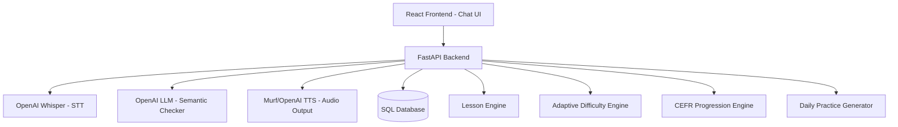
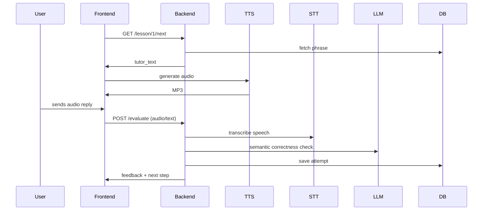

# **Patient Polish Tutor – Cursor Implementation Guide (Phase A)**

### *Version: v2.1.0 – Improved Edition*

**Target:** Cursor Agents  
**Goal:** Implement **Phase A – React Chat UI Skeleton + Component Architecture**  
**Scope:** Build a standalone React SPA under `frontend-react/` using mocks only

---

# ⚓ PURPOSE OF THIS DOCUMENT

Cursor must use this file to:

1. **Create** a new React project (Vite + TS + Tailwind)
2. **Build** the **entire Chat UI** for the Polish Tutor (Phase A)
3. **Use ONLY mock data** (no backend calls except optional TTS playback)
4. **Implement the required state machine**
5. **Keep everything inside `frontend-react/`**
6. **Prepare the structure** for Phase B backend integration

Cursor must **NOT touch any backend code**, **legacy Jinja templates**, or existing routes.

This document defines **exactly** what Cursor may generate and where.

---

# ✅ Phase A Completion Summary

The `frontend-react/` workspace now contains a fully operational Phase A implementation:

* **Vite + React + TypeScript + Tailwind** configured (`package.json`, `vite.config.ts`, `tailwind.config.js`, `postcss.config.js`, `src/index.css`).
* **Routing** for `/lesson/:id` and `/summary` defined in `App.tsx`, with `/` redirecting to `lesson_mock_001`.
* **All required components** created under `src/components/**`.
* **Chat UI** wired via `ChatContainer`, `TutorMessage`, `UserMessage`, `FeedbackMessage`, `TypingIndicator`.
* **Mock lesson flow** implemented using `useLessonState`, `lessonMachine`, and `useAudioQueue`.
* **Controls:** `ProgressIndicator`, `ScoreBadge`, `MicRecordButton`, `PlayButton`.
* **Key phrase UI:** `KeyPhrasesPanel`, `KeyPhraseCard`, `KeyPhraseRow`.
* **LessonSummaryPage** with mock stats and navigation.
* **Auto-scroll** behavior functioning inside `ChatContainer`.
* **Static mock audio** support from `public/mock_audio/*.mp3`.
* **No backend or legacy Jinja templates modified.**

Phase A is complete and ready for backend integration.

---

# 🚧 Phase B – Functional Requirements

Backend integration tasks (frontend stays unchanged unless noted):

1. Implement `/api/audio/generate` using Murf TTS (primary voice engine).
2. Implement `/speech/recognize` using Whisper (local `tiny` or OpenAI Whisper).
3. Build evaluation service: STT transcription → phonetic similarity → semantic LLM scoring.
4. Replace mock playback in `PlayButton` with the backend TTS endpoint.
5. Replace mock behavior in `MicRecordButton` with real recording + POST to `/speech/recognize`.
6. Store phrase attempts (phonetic score, semantic score, timestamps) in SQLAlchemy models.
7. Add lesson navigation endpoints (`GET /lesson/{id}/next`, `POST /lesson/{id}/answer`).
8. Keep the React UI/state machine unchanged unless integration demands small adjustments.
9. Ensure compatibility with the existing Phase A flow.

---

# 📂 Phase B Directory Map

Expected backend files to create/update:

* `backend/api/routers/audio.py`
* `backend/api/routers/speech.py`
* `backend/api/routers/lesson.py`
* `backend/services/murf_tts.py`
* `backend/services/whisper_stt.py`
* `backend/services/evaluator.py`
* `backend/schemas/lesson.py`
* `backend/schemas/evaluation.py`
* `backend/models/attempt.py`
* `backend/models/lesson.py`
* `backend/db/session.py`

---

# 🛠 Phase B Execution Order

1. Implement Murf TTS backend endpoint.
2. Implement Whisper STT endpoint.
3. Implement evaluation service (phonetic + semantic scoring).
4. Add database models and migrations (phrase attempts, lessons).
5. Implement lesson navigation endpoints.
6. Connect frontend `PlayButton` to hit `/api/audio/generate`.
7. Connect frontend `MicRecordButton` to send audio to `/speech/recognize`.
8. Replace mock scoring with backend evaluation responses.
9. Switch lesson data source from mocks to the database.

---

# 🏛 PROJECT ROOT STRUCTURE (STRICT)

Cursor must assume the root folder has:

```
project-root/
│
├── backend/
│   └── ...
├── frontend-react/        # NEW — must be created
└── docs/
    └── cursor/
        └── cursor_phase_a_instructions.md
```

Cursor must **only modify `frontend-react/`**. No other folder may be touched.

---

# 🌐 FRONTEND STACK & COMMANDS (MANDATORY)

**Stack:** Vite + React + TypeScript + TailwindCSS + React Router DOM  
**Do NOT add** ESLint/Prettier unless requested later.

Cursor MUST run:

```
npm create vite@latest frontend-react --template react-ts
cd frontend-react
npm install
npm install react-router-dom
npm install -D tailwindcss postcss autoprefixer
npx tailwindcss init -p
```

Tailwind must be wired into `tailwind.config.js` and `src/index.css` using official setup steps.

Update `vite.config.ts` to lock the dev server port (avoids `/app/*` conflicts with FastAPI in production):

```ts
import { defineConfig } from "vite";
import react from "@vitejs/plugin-react";

export default defineConfig({
  plugins: [react()],
  server: {
    port: 5173,
  },
});
```

---

# 🧭 FRONTEND ROUTING (REQUIRED)

Routes:

```
/app/*            → React SPA
/app/lesson/:id   → LessonChatPage
/app/summary      → LessonSummaryPage
```

`App.tsx` must include:

```tsx
<BrowserRouter>
  <Routes>
    <Route path="/lesson/:id" element={<LessonChatPage />} />
    <Route path="/summary" element={<LessonSummaryPage />} />
  </Routes>
</BrowserRouter>
```

**During development:** Vite serves the SPA under `/`. The `/app/*` prefix only applies when FastAPI hosts the production build, so `BrowserRouter` should keep `/lesson/:id` and `/summary` paths without `/app`.

---

# 🗺 HIGH-LEVEL ARCHITECTURE CONTEXT



*Phase A focuses solely on node **A** (React frontend). Nodes **B–J** are future work.*

---

# **1. Frontend Upgrade — Conversational Chat UI**

## 1.1 Replace Static Preview with Chat Messages

Each phrase must render as a conversational exchange with:
- Tutor bubble (auto TTS playback)
- User bubble (mock transcript)
- Playback icon
- Mic icon (mock recording)
- Score badge

## 1.2 Components to Build

- `<ChatContainer />`
- `<TutorMessage />`
- `<UserMessage />`
- `<ProgressIndicator />`
- `<KeyPhraseCard />` (collapsible)
- `<PlayButton />`
- `<MicRecordButton />`
- `<ScoringBadge />`

## 1.3 Event Flow (UI-Only)

1. Load mock lesson data
2. Show first tutor message only
3. Auto-play TTS (`/api/audio/generate` or mock)
4. Wait for mock reply (MicButton/Text)
5. Run mock evaluator
6. Display feedback bubble + score
7. Advance to next phrase until done

---

## 2.2 Lesson Flow (Backend Awareness)

*Phase A simulates this flow; real integration arrives in Phases B–C.*



---

# 🎤 3. Speech Pipeline (Future Reference)

## 3.1 Audio Input
`POST /speech/recognize` accepts WebM/WAV/OGG/PCM.

## 3.2 Whisper STT Options
- Local `whisper-tiny` (fast)
- OpenAI Whisper API (best quality)

## 3.3 Scoring Algorithm (Phase B)
```
final_score = 0.6 * phoneticSimilarity + 0.4 * semanticScore
```

## 3.4 Decision Rules
- `score >= 0.85` → Perfect
- `0.70–0.85` → Good
- `< 0.70` → Retry

Phase A must mock these outcomes.

---

# 🏗 PHASE A — FILES & DIRECTORIES (STRICT)

```
frontend-react/
  src/
    components/
      messages/
        TutorMessage.tsx
        UserMessage.tsx
        FeedbackMessage.tsx
        TypingIndicator.tsx

      controls/
        MicButton.tsx
        PlayButton.tsx
        ProgressIndicator.tsx
        ScoreBadge.tsx

      ChatContainer.tsx
      KeyPhrasesPanel.tsx
      KeyPhraseRow.tsx
      LessonSummaryPage.tsx

    pages/
      LessonChatPage.tsx

    state/
      useLessonState.ts
      lessonMachine.ts
      useAudioQueue.ts

    lib/
      mockLessonProvider.ts
      mockEvaluator.ts

    App.tsx
    main.tsx
```

Cursor must create **each file**.

---

# 📦 ChatContainer Requirements

`src/components/ChatContainer.tsx` must:

* Accept `messages: ChatMessage[]` via props.
* Render tutor/user/feedback bubbles vertically with Tailwind spacing.
* Apply scrollable container styles (`overflow-y-auto`, `max-h-*`).
* Auto-scroll on every message change:
  ```ts
  const bottomRef = useRef<HTMLDivElement | null>(null);
  useEffect(() => {
    bottomRef.current?.scrollIntoView({ behavior: "smooth" });
  }, [messages]);
  ```
* Include `<div ref={bottomRef} />` at the end of the list.

Cursor must not merge this behavior into other components.

---

# 🎛 UI STATE MACHINE CONTRACT

```ts
export type LessonState =
  | "TUTOR_SPEAKING"
  | "WAITING_FOR_USER"
  | "RECORDING"
  | "EVALUATING"
  | "FEEDBACK"
  | "NEXT_PHRASE"
  | "FINISHED";
```

Transitions:
```
TUTOR_SPEAKING → WAITING_FOR_USER
WAITING_FOR_USER → RECORDING
RECORDING → EVALUATING
EVALUATING → FEEDBACK
FEEDBACK → NEXT_PHRASE
NEXT_PHRASE → TUTOR_SPEAKING or FINISHED
```

No other states allowed.

---

# 🧠 useLessonState CONTRACT

`useLessonState` must expose:

```ts
const {
  state,
  currentPhrase,
  phraseIndex,
  messages,
  sendUserMessage,
  nextPhrase,
} = useLessonState();
```

All backend work is mocked.

---

# 🗣 Chat Message Model (ALWAYS)

```ts
export interface ChatMessage {
  id: string;
  sender: "tutor" | "user" | "feedback";
  text: string;
  audioUrl?: string;
  score?: number;
}
```

Cursor must reuse this shape everywhere.

---

# 🧪 Mock Lesson Provider — STRICT

`mockLessonProvider.ts` must export:

```ts
export function getMockLesson() {
  return {
    id: "lesson_mock_001",
    phrases: [
      { id: "p1", pl: "Cześć!", en: "Hi!" },
      { id: "p2", pl: "Jak się masz?", en: "How are you?" },
      { id: "p3", pl: "Miłego dnia!", en: "Have a good day!" }
    ]
  };
}
```

Cursor must not change this schema.

---

# 🎤 Mic Button — MOCK ONLY

MicButton must **NOT** implement real audio. It should simply call a callback like:

```ts
onTranscript("jak się masz");
```

No MediaRecorder, no microphone access.

---

# 🔊 Play Button — Safe TTS

Cursor may call `/api/audio/generate`, but must also support a mock audio source. If unsure, use only mock audio blobs.

---

# 🏁 Lesson Summary Page

`LessonSummaryPage.tsx` must display:
- Total phrases
- Correct count (mock)
- Mock score
- "Start next lesson" button (non-functional)

---

# 🧱 UI DESIGN RULES

- Tutor bubble: left, blue-100
- User bubble: right, green-100
- Feedback bubble: centered, yellow-100
- Use Tailwind classes such as `rounded-xl`, `shadow`, `px-4 py-2`, `max-w-[75%]`
- Messages animate on entry (fade/slide)
- Chat auto-scroll is mandatory

---

# ⚠ DO NOT TOUCH LIST

Cursor must **NOT**:
- Modify backend Python files
- Modify database models/migrations
- Touch `frontend/templates/`
- Add Whisper/OpenAI integration
- Implement real audio capture or scoring
- Add ESLint/Prettier/Docker

---

# 🧪 Mock Evaluator CONTRACT

`mockEvaluator.ts` must export:

```ts
export function evaluateMock(text: string) {
  const score = Math.random();
  return {
    score,
    feedback:
      score > 0.85 ? "Perfect!" :
      score > 0.70 ? "Good, try again!" :
      "Try again, focus on the pronunciation.",
    passed: score > 0.70
  };
}
```

No extra fields.

---

# 🧩 Definition of Done (Phase A)

Cursor must ensure:

- ✅ React project builds without errors
- ✅ Routing works at `/app/*`
- ✅ LessonChatPage uses mock lesson data
- ✅ State machine transitions implemented
- ✅ Chat auto-scroll works
- ✅ Mock evaluator + mock mic wiring working
- ✅ All specified components exist
- ✅ No backend/Jinja files changed

If any item fails, Cursor must revise.

---

# 🚀 Final Cursor Prompt (Use to Begin Coding)

```
Follow instructions in docs/cursor/cursor_phase_a_instructions.md.
Begin Phase A: create a new React project under frontend-react/ using Vite + React + TypeScript + TailwindCSS.
Do NOT modify backend or legacy Jinja templates.
Create the full folder structure and stub components exactly as specified.
Use mock data and mock evaluators only.
Respond ONLY with file creations and code changes.
```

---

# 🎉 Phase A Guide Complete

This document is now:

- Stricter
- Unambiguous
- Cursor-safe
- Ready for production use

When ready, request Phase B instructions (backend STT + evaluation) or Phase C/D specs.
