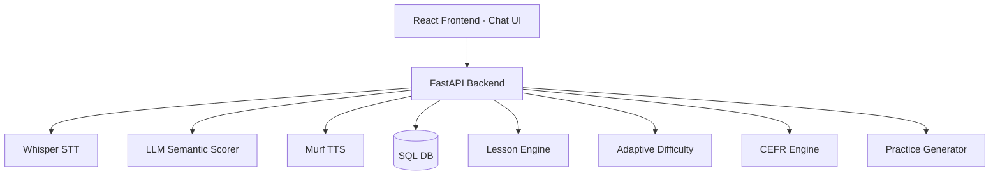

# Patient Polish Tutor — UI Redesign Roadmap (v2.0.0 → v2.3.0)
_Last updated: 2025-11-16_

## Phase A Completion Summary (v2.0.1)
Phase A (React SPA foundation) is now **fully implemented** inside `frontend-react/`.

Completed deliverables:
- Vite + React + TypeScript + Tailwind scaffold
- Routing for `/lesson/:id`, `/summary`, and root redirect
- Components: TutorMessage, UserMessage, FeedbackMessage, TypingIndicator, MicRecordButton, PlayButton, ProgressIndicator, ScoreBadge, KeyPhrasesPanel, KeyPhraseCard, KeyPhraseRow, LessonSummaryPage
- State machine: `lessonMachine.ts`, `useLessonState.ts`, `useAudioQueue.ts`
- Mock lesson provider + mock evaluator
- ChatContainer with auto-scroll + typing indicator
- Replay button working via `/public/mock_audio/*.mp3`
- Backend + Jinja templates untouched (clean boundary)
- Fully isolated Phase A UI in React SPA

This version is tagged internally as `v2.0.1-alpha-stable`.

---

## Table of Contents
1. Phase Options  
2. Current Status vs Roadmap  
3. Coexistence & Deployment  
4. Shared Terminology  
5. Recommended React Setup  
6. Cursor / Automation Notes  
7. Testing Strategy  
8. Architecture Diagram  
9. API Versioning  
10. Security Notes  
11. UI State Machine  
12. Phase A (Complete)  
13. Phase B Preparation Notes  
14. Phase B (STT + Evaluation)  
15. Phase C (Database & CEFR)  
16. Phase D (UI Enhancements)  
17. Versioning & Milestones  
18. Next Action  

---

## Phase Options (Execute in Order)
1. **A — React Component Implementation** (v2.0.x) — _DONE_  
2. **B — Backend STT + Evaluation Endpoints** (v2.1.x) — NEXT  
3. **C — Database Schema & Migrations** (v2.2.x)  
4. **D — v2 UI Enhancements** (v2.3.x)  

> **Workflow rule:** Never break the order A → B → C → D.  
> Frontend → Backend → DB → Enhanced UI.

---

## Current Status vs Roadmap

| Area | Status | Notes |
|------|--------|-------|
| Legacy UI (Jinja preview) | ✅ | Static preview still available at dashboard.html |
| Backend TTS (Murf) | ✅ | `/api/audio/generate` stable and cached |
| Murf engine + caching | ✅ | Production-ready |
| **A — React Chat UI** | **✅ DONE** | Entire Phase A delivered under `frontend-react/` |
| **B — STT + Evaluation** | ❌ | Must implement Whisper STT + evaluator |
| **C — Database (v2)** | ❌ | Need phrase_attempts, user_progress, CEFR metrics |
| **D — UI Enhancements** | ❌ | Stars, CEFR badges, micro-animations |

---

## Coexistence & Deployment Plan
- React SPA lives under `/app/*` (FastAPI static mount).  
- Legacy preview remains during Phase B & C.  
- Cutover only after D is stable.

---

## Shared Terminology

| Term | Meaning |
|------|---------|
| SPA | React UI in `frontend-react/` |
| Legacy UI | Jinja preview (dashboard.html) |
| Lesson Engine | Backend progression logic |
| Phase A UI | The new React chat UI |

---

## Recommended React Setup (Phase A)
- Vite + React + TS
- TailwindCSS + PostCSS
- Strict component structure (`components/messages`, `components/controls`, etc.)
- Deterministic mock lesson provider

_Done exactly as required._

---

## Cursor / Automation Notes
- All Phase B/C/D backend code must live under:  
  - `src/api/v2/...`  
  - `src/services/...`  
- **React Phase A code must not change during Phase B.**

---

## Testing Strategy
- Frontend → Vitest + React Testing Library  
- Backend → Pytest  
- DB → Alembic migration tests

---

## Architecture Diagram

---

## API Versioning
- All Phase B/C/D endpoints go under `/api/v2/...`  
- `/api/audio/generate` remains backward compatible  
- Legacy endpoints deprecated only at v2.3

---

## Security Notes
- Audio uploads private; use signed URLs  
- Never log transcripts or raw audio  
- Rotate API keys (Murf, Whisper, LLM)

---

## UI State Machine (Universal)
TUTOR_SPEAKING → WAITING_FOR_USER → RECORDING → EVALUATING → FEEDBACK → NEXT_PHRASE → loop

---

# Phase A — Complete (v2.0.1)
Everything implemented as originally designed.

---

# Phase B Preparation Notes (Important)
Phase B introduces real audio processing:

You must create:
`src/api/v2/speech.py`  
`src/api/v2/evaluate.py`  
`src/api/v2/lesson.py`  
`src/services/whisper_stt.py`  
`src/services/murf_tts.py`  
`src/services/evaluator.py`

Mock evaluator will be replaced by real STT → scoring pipeline.

---

# Phase B — Backend STT + Evaluation (v2.1.x)
## Endpoints

### POST /api/v2/speech/recognize
→ Whisper STT  
→ Return transcript + word timings

### POST /api/v2/evaluate
→ Compare transcript to expected phrase  
→ LLM semantic scoring + pronunciation scoring  
→ Return score, feedback, hint, passed/failed  

### GET /api/v2/lesson/{id}/next
→ Backend progression (not React-side mock)

## Order of Work
1. Whisper STT  
2. Evaluator (phonetic + semantic)  
3. Lesson navigation  
4. Mock-mode fallback  

---

# Phase C — Database Schema (v2.2.x)
Tables:
- phrase_attempts  
- user_progress  
- user_stats  
- daily_reviews  
- cached_audio (optional)

With full Alembic migrations.

---

# Phase D — v2 UI Enhancements (v2.3.x)
Features:
- CEFR badges  
- XP bar  
- Retry animations  
- Stars  
- Adaptive hints  
- Audio waveform  
- Scoring history  

---

## Versioning & Milestones

| Phase | Version | Status |
|-------|---------|--------|
| A | v2.0.x | ✅ Done |
| B | v2.1.x | 🚧 Next |
| C | v2.2.x | Pending |
| D | v2.3.x | Pending |

---

# Next Action
Proceed to **Phase B**: implement STT + evaluator endpoints.  
React UI remains unchanged until B → C → D are complete.
